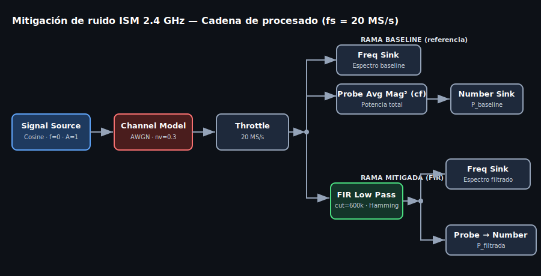
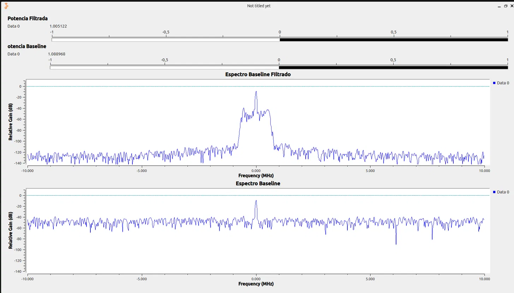
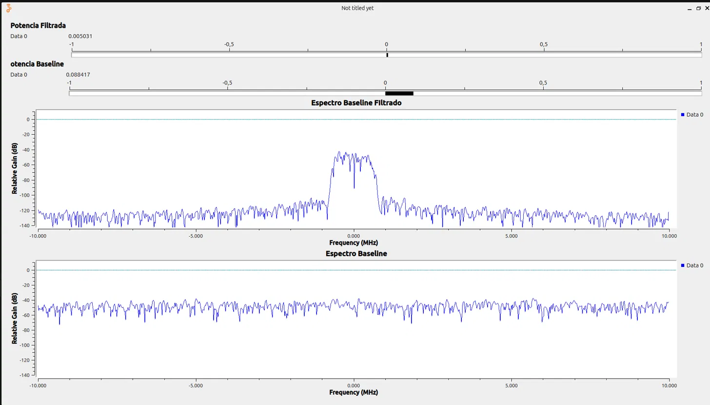

# Mitigación de ruido en banda ISM 2.4 GHz con SDR y GNU Radio

Proyecto de laboratorio con SDR. La idea: caracterizar cómo se degrada una señal en la banda de 2.4 GHz (la del WiFi, Bluetooth, el microondas...) cuando hay ruido, y aplicar un filtro FIR digital para recuperar relación señal-ruido. Con las medidas que tomé, la mejora de SNR sale de **12.44 dB**.

Aclaración sobre el montaje: el front-end previsto para esto es un HackRF One, pero las medidas de este repo las hice sobre un banco de pruebas en simulación, con el bloque Channel Model de GNU Radio inyectando ruido AWGN. Así el experimento es reproducible sin depender del espectro real ni de tener el equipo delante, y la cadena de procesado (ganancias en banda base + FIR) es la misma que aplicaría con una fuente HackRF real.

## Qué hace

- Genera una señal en banda base y le mete ruido, simulando un canal ISM 2.4 GHz contaminado.
- Le pasa un filtro FIR paso-bajo que deja la señal y recorta el ruido de las zonas del espectro donde no hay nada útil.
- Mide la potencia antes y después de filtrar para calcular cuánto sube la SNR.

## Montaje



La lógica del flowgraph: genero la señal, la ensucio con ruido, y a partir de ahí parto la cadena en dos ramas. Una la dejo tal cual (mi referencia, el "antes") y la otra pasa por el filtro (el "después"). Cada rama tiene su visor de espectro y su medidor de potencia, así comparo las dos en la misma ejecución.

Muestreo a 20 MS/s, ventana de análisis de 20 MHz.


Al principio puse la señal en 2 MHz, pero acabé moviéndola a 0 Hz (banda base pura) porque simplifica el filtrado: con la señal centrada basta un paso-bajo, si no habría que montar un paso-banda.

## El filtro: por qué estos números

El filtro sale de `firdes.low_pass`:

```python
firdes.low_pass(1, 20e6, 600e3, 200e3, window.WIN_HAMMING, 6.76)
```

Lo que tardé en pillar: la mejora de SNR no viene de amplificar la señal, viene de reducir el ancho de banda por el que entra ruido, dejando la señal intacta. La relación es

```
Mejora_SNR (dB) = 10 · log10( BW_ruido / BW_filtro )
```

Quería apuntar a unos 12 dB, así que despejé el ancho de paso necesario:

```
BW_filtro = 20 MHz / 10^(12/10) = 20 MHz / 15.85 ≈ 1.26 MHz
```

De ahí el corte en 600 kHz (ancho de paso bilateral de ~1.2 MHz). El ancho de transición (200 kHz) fija además la longitud del filtro: con ventana Hamming salen del orden de 3.3·fs/Δf ≈ 330 coeficientes. Estrechar más la transición da un filtro más selectivo pero con más coste de cálculo y más retardo. 200 kHz me pareció un compromiso razonable.

De hecho la primera versión que probé tenía el corte en 10 MHz y la mejora era prácticamente 0 dB: el filtro abarcaba toda la banda visible y no recortaba nada. Bajarlo a 600 kHz fue lo que hizo aparecer los 12 dB.

## Cómo medí la SNR

Hay un detalle que se pasa por alto fácil: el medidor de potencia (Probe Avg Mag²) mide potencia total, señal y ruido mezclados. Para separar las dos componentes ejecuté el flowgraph dos veces:

- Señal encendida (Amplitude = 1): potencia total.
- Señal apagada (Amplitude = 0): solo el ruido.

Restando (ON - OFF) sale la potencia de señal limpia, y de ahí la SNR de cada rama.

## Resultados

Las cuatro lecturas de potencia:

| Medición | Baseline | Filtrada |
|---|---|---|
| Señal ON (Amplitude = 1) | 1.088968 | 1.005122 |
| Solo ruido (Amplitude = 0) | 0.088417 | 0.005031 |

El cálculo:

```
P_señal_baseline = 1.088968 - 0.088417 = 1.000551
P_señal_filtrada = 1.005122 - 0.005031 = 1.000091

SNR_antes   = 10·log10(1.000551 / 0.088417) = 10.54 dB
SNR_después = 10·log10(1.000091 / 0.005031) = 22.98 dB

Mejora = 22.98 - 10.54 = 12.44 dB
```

Dos comprobaciones que me cuadran:

1. La señal casi no se toca al filtrar (de 1.000551 a 1.000091, pérdida de inserción de ~0.002 dB). La mejora viene entera de quitar ruido, no de deformar la señal.
2. La reducción de ruido medida directamente, 10·log10(0.088417/0.005031) = 12.45 dB, coincide con la predicción teórica de arriba.

En el espectro se ve claro. Con la señal encendida, el suelo de ruido fuera de banda cae unos 70 dB tras el filtro:



Y con la señal apagada se ve el ruido puro antes y después, que es de donde salen las lecturas OFF:



## Un error que no me dejaba compilar y ejecutar

Al conectar el medidor de potencia me saltaba esto al ejecutar:

```
ValueError: port number 0 exceeds max of (none)
```

Me tiré un buen rato con esto (llegué a sospechar del Number Sink, que no tenía nada que ver) hasta que caí: el bloque Probe Avg Mag² en su variante Complex (`probe_avg_mag_sqrd_c`) no tiene salida por streaming. Es un sumidero que se consulta por código con `.level()`, por eso GNU Radio se quejaba de que intentaba conectar un puerto que no existe. La solución fue usar la variante Complex → Float (`probe_avg_mag_sqrd_cf`), que sí saca un float conectable al display numérico.

## Hasta dónde llega esto

No se puede estrechar el filtro indefinidamente para ganar más SNR. El ancho de paso solo se puede reducir hasta el ancho de banda de la propia señal. En mi banco de pruebas la señal es prácticamente un tono (muy estrecha), así que hay mucho margen. Pero un WiFi real ocupa ~20 MHz, y filtrar por debajo de eso recorta la señal misma: distorsión, pérdida de datos. El óptimo teórico sería un filtro adaptado al ancho exacto de la señal. En la práctica el filtrado se combina con otras cosas: cambiar de canal, espectro ensanchado, codificación, antenas directivas.

## Estructura del repo

```
.
├── README.md
├── src/Proyecto1.py          # Flowgraph generado (Python)
├── grc/Proyecto1.grc         # Flowgraph editable (GNU Radio Companion)
└── media/
    ├── diagrama_bloques.svg
    ├── flowgraph_grc.png
    ├── espectro_on.png        # Espectros con señal (Amplitude=1)
    └── espectro_off.png       # Espectros solo ruido (Amplitude=0)
```

## Ejecución

Desde GNU Radio Companion: abrir `grc/Proyecto1.grc`, Generate (F5), Run (F6). O directamente:

```bash
python3 src/Proyecto1.py
```

Para reproducir las medidas: ejecutar con Amplitude = 1 y anotar las dos potencias, luego con Amplitude = 0 y anotar las otras dos, y aplicar las fórmulas de la sección de resultados.
